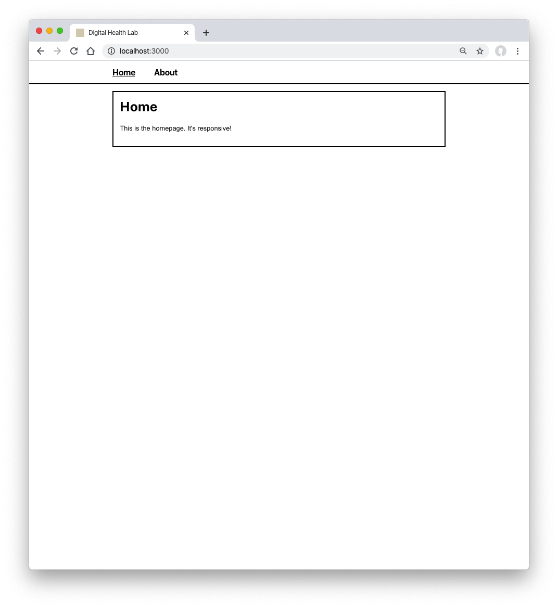
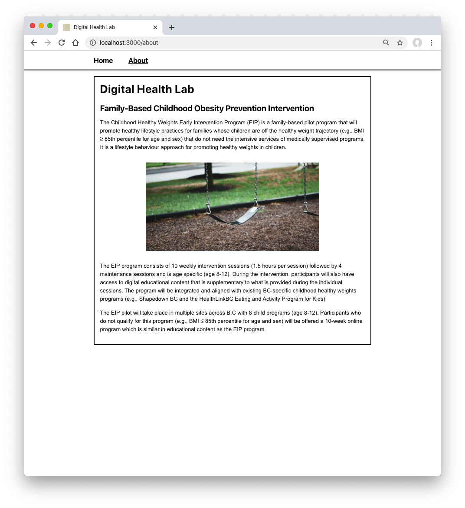
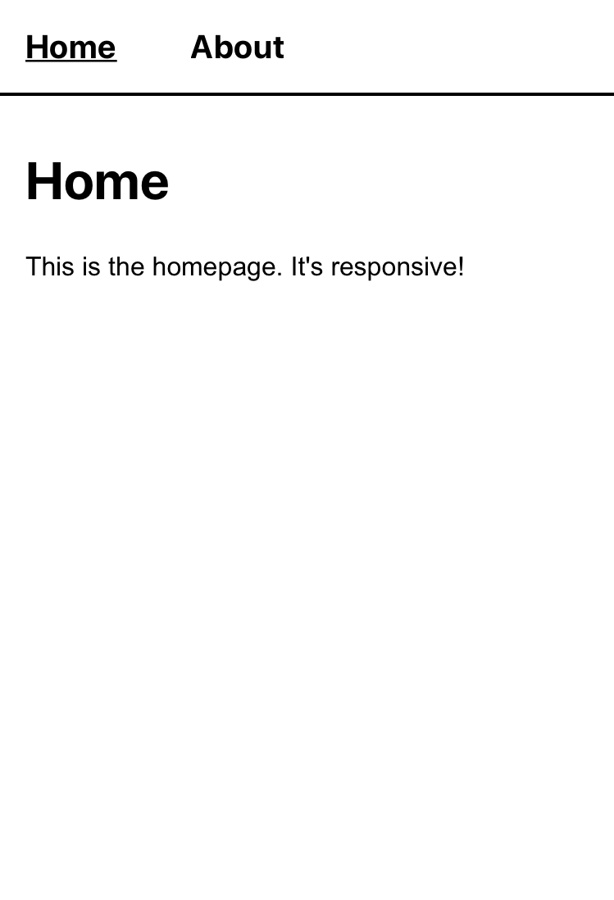
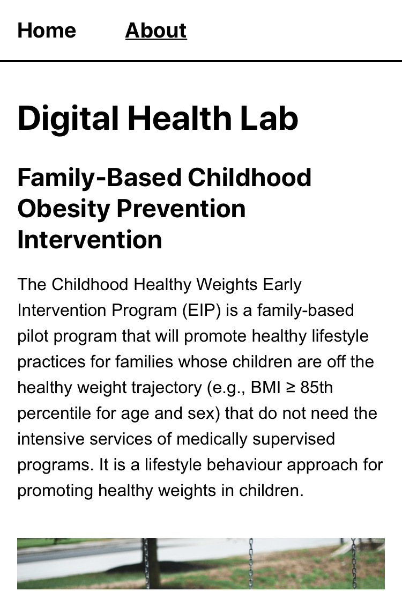

# Digital Health Lab - Coding Challenge
This project was bootstrapped with [Create React App](https://create-react-app.dev/docs/getting-started/)
## Overview
- create a responsive landing page with a title and a header using ReactJS
OR
- a very basic mobile login page using Flutter(just fields, a button, and an icon).

You can ignore all the functionalities and functions behind the scene, just a front end is enough (just UI components), unless you want to challenge yourself!

## To Run
1. `npm i`
2. `npm run start`
3. site served at http://localhost:3000/

## Screenshots

### Desktop

### Mobile
> </img>

> </img>
